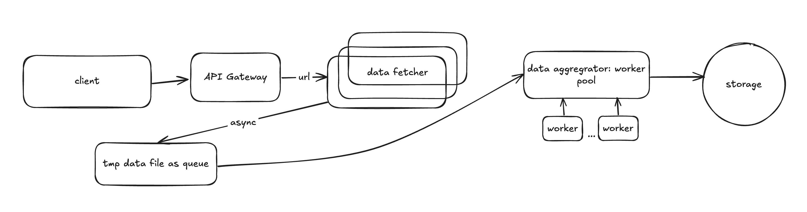

# Concurrent-data-processing-pipeline

## Overview
- Build a concurrent data processing pipeline that fetches, processes, and stores data from multiple APIs. 
- Output is a json file contains summary, product details, errors and metrics(price_metrics, category_distribution, source_request_counts)
 
**Language:** Python 

**Frameworks**: FastAPI  

**CLI**: Yes  

**Containerization**: Docker

## File Structure
    
    Concurrent-data-processing-pipeline/
    │
    ├── app/                   
    │   ├── main.py            # FastAPI app and CLI implementations
    │   ├── args.json          # For CLI usage
    │   └── output/            # Folder containing output data
    │       └── example_output.json  # Example of processed output data
    │
    ├── tests/                 
    │   ├── test_integration.py   # Test for integration (end to end)
    │   ├── test_unit.py        # Test for important functions
    │   └── args.json          # For CLI usage
    │
    ├── README.md              # Project overview and instructions
    ├── AI_USAGE.md            # AI usage document
    ├── Dockerfile             # Dockerfile for containerization
    ├── requirements.txt       # Project dependencies and environment setup
    └── .gitignore             # Ignored files (e.g., __pycache__)

## Brief Architecture Overview

Asynchronous Data Fetching -> Local Files (as Queue) ->  Synchronous Data Processing

1. **Asynchronous Data Fetching**: Data is fetched asynchronously from multiple endpoints and stored in temporary local files to avoid memory issues.
   
2. **Local Files (as Queue)**: The fetched data is saved in local files, which act as a queue for the synchronous processing step.

3. **Synchronous Data Processing**: The files are processed synchronously in a thread pool, where the data is processed, and the output file is generated. After processing, the temporary local files are deleted.

## Tradeoffs Considered

During the development of this pipeline, three different approaches for handling the intermediate data were considered:

### 1. **Using an Asynchronous Queue**:
   - **Pros**: This approach would allow continuous data flow and avoid storing intermediate files.
   - **Cons**: Asynchronous queues can become inefficient when dealing with large data volumes, as they require significant memory allocation. This could lead to performance degradation when handling a large number of items.
   
### 2. **Using a List to Save Intermediate Data**:
   - **Pros**: A list would allow for quick access to in-memory data, and the processing could proceed directly without needing to handle file I/O.
   - **Cons**: Similar to the queue, storing data in a list consumes memory. For large datasets, this can lead to high memory usage, potentially resulting in memory-related issues.
   
### 3. **Storing Data in Local Files (Chosen Approach)**:
   - **Pros**: This approach avoids memory usage spikes by storing the intermediate data on disk. It allows for scalability even when the dataset grows large.
   - **Cons**: File I/O introduces some latency, and managing files might be more complex. However, the benefits of reduced memory usage outweigh the minor performance penalty.

## Mock API Endpoints
For testing, the following mock APIs are used:
1. [JSON Placeholder](https://jsonplaceholder.typicode.com/posts) - Products data
2. [Reqres](https://reqres.in/api/users?page={page}) - Products data
3. [Httpbin](https://httpbin.org/delay/1) - Simulates unreliable API
4. [Dummyjson](https://dummyjson.com/products) - Actual product data

## Technologies Used
- **FastAPI** for building the API endpoints.
- **Asyncio** for asynchronous programming.
- **Httpx** for async HTTP requests.
- **ThreadPoolExecutor** for managing worker pools and parallel processing.
- **TQDM** for displaying progress bars during the file processing.
- **Logging** for handling application logs with different log levels (INFO, DEBUG, ERROR).
- **CircuitBreaker** for handling service failures with retry logic and automatic recovery.
- **AsyncLimiter (5, 1)** for rate-limiting requests (5 requests per second).
- **Pydantic** for data validation and defining models (e.g., `ProductItem`, `OutputModel`).
- **Argparse** for command-line interface (CLI) integration.
- **JSON** for storing and handling intermediate data files.
- **Docker** for containerization of the project.


## AI Tool Usage
- Use chatGPT for this project, for more details, please have a look at `AI_USAGE.md`

## How to Run

### Prerequisites

Ensure you have the following installed:
- Python
- Docker

### Running the Project

1. **Clone the repository**:
   ```bash
   git clone https://github.com/FrozenfireMinghang/Concurrent-data-processing-pipeline.git
   cd Concurrent-data-processing-pipeline

2. **Install dependencies**:

- Using pip:
    ```bash
    pip3 install -r requirements.txt
3. **Run the application**:

- **Option 1**: Using FastAPI with Uvicorn

    ```bash
    cd Concurrent-data-processing-pipeline
    uvicorn app.main:app --reload
* The application will be available at http://127.0.0.1:8000.

- **Option 2**: Using Docker

    Build the Docker image:

    ```bash
    docker build -t my-fastapi-app . 
    docker run -p 8000:8000 my-fastapi-app
- **Option 3**: Run CLI commands:
    The project includes a CLI for interacting with the pipeline. 
    there are three options for commands
    1. --url: URLs to fetch
    2. --workers: Number of concurrent workers to process the fetched files
    3. --args_file: Path to a JSON file with URLs and headers configuration

    Example commands:
    ```bash
    python3 main.py --url "https://jsonplaceholder.typicode.com/posts|jsonplaceholder|0" --workers 7
    python3 main.py --url "https://jsonplaceholder.typicode.com/posts|jsonplaceholder|0" --args_file "args.json"

### Running the Test (unit tests and integration tests)
1. **Go to the folder**:
    ```bash
    cd Concurrent-data-processing-pipeline
2. **Run the commands**:
    ```bash
    pytest tests/test_integration.py
    pytest tests/test_unit.py
## Visual Enhancements

To improve user experience, the project incorporates several visual elements:
- **Progress Bars (TQDM)**: During data fetching and processing, progress bars are displayed to provide real-time feedback on the ongoing tasks. This makes it easier for users to monitor the pipeline's progress, especially when processing large datasets.

    Example progress bar(can be seen in the terminal):
    ```bash
    2025-07-22 16:48:32,082 - INFO - Total files to process: 13
    Processing files:  31%|█████▌            | 4/13 [00:00<00:00, 359.32file/s, Progress=38.5% finished]
- **Logging Levels**: The project uses Python's `logging` module to handle different log levels (INFO, DEBUG, ERROR).
  
If you'd like to see what the final output looks like, feel free to check out the `example_output.json` in the `/app/output` folder.